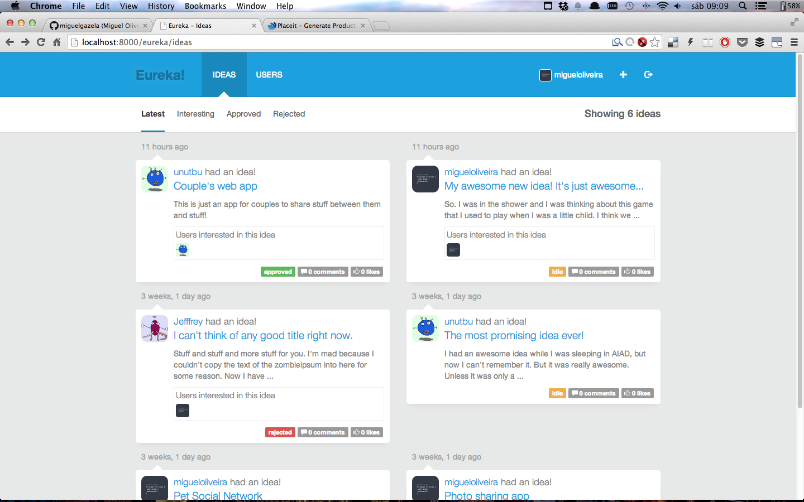
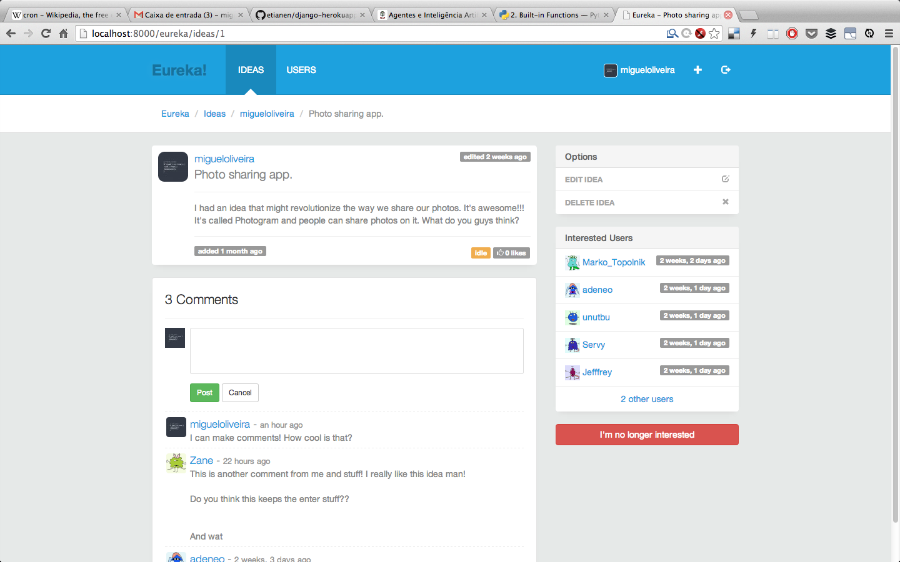
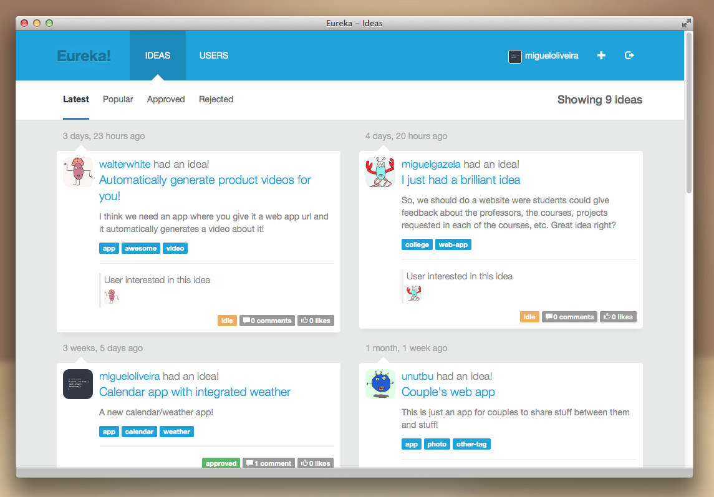
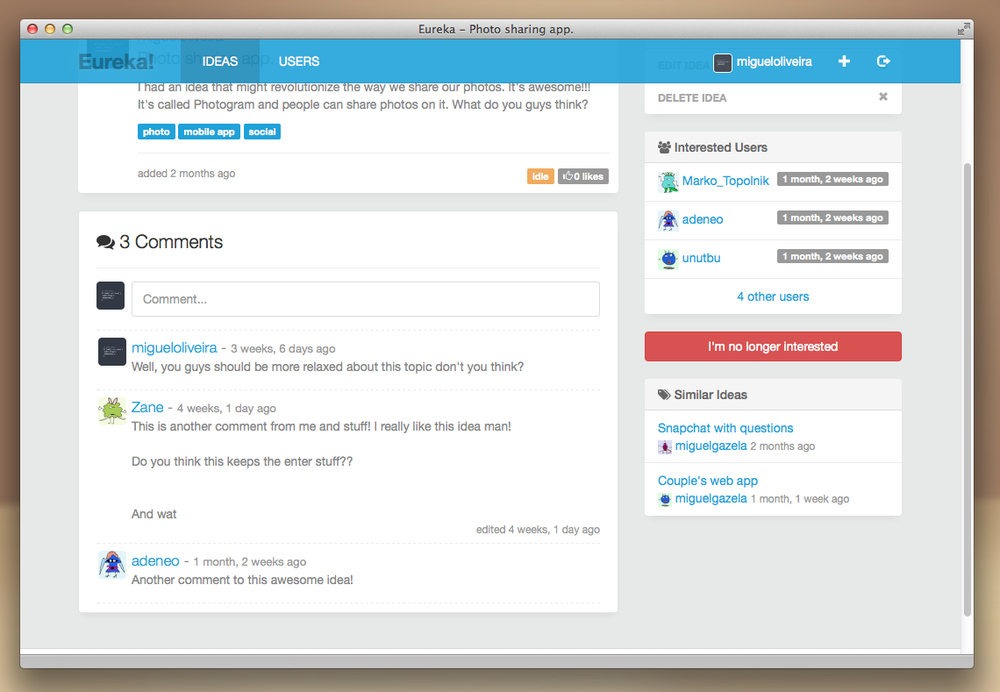
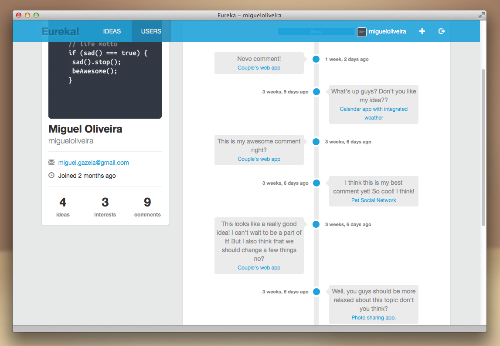

eureka
======

An idea submission platform for juniFEUP

### Installation

1. Install [pip](http://pip.readthedocs.org/en/latest/installing.html)

2. Install [virtualenv](https://pypi.python.org/pypi/virtualenv) and [virtualenvwrapper](http://virtualenvwrapper.readthedocs.org/en/latest/)
```sh
$ pip install virtualenvwrapper
```

3. After virtualenvwrapper is installed, add the following to your .bash_profile
```sh
export WORKON_HOME=$HOME/.virtualenvs
export PROJECT_HOME=$HOME/directory-you-do-development-in
source /usr/local/bin/virtualenvwrapper.sh
```

4. Create a new virtual environment
```sh
$ mkvirtualenv eureka
```

5. Navigate to the repo folder
```sh
$ cd eureka
```

6. Install dependencies
```sh
$ pip install -r requirements.txt
```

7. Navigate to the project folder
```sh
$ cd eureka
```

8. Sync database and run migrations
```sh
$ python manage.py syncdb
$ python manage.py migrate protein_folding_analysis
```

9. Start local server
```sh
$ python manage.py runserver
```

### Screenshots







### Related Resources:

* Virtualenv guide: [http://docs.python-guide.org/en/latest/dev/virtualenvs/](http://docs.python-guide.org/en/latest/dev/virtualenvs/)
